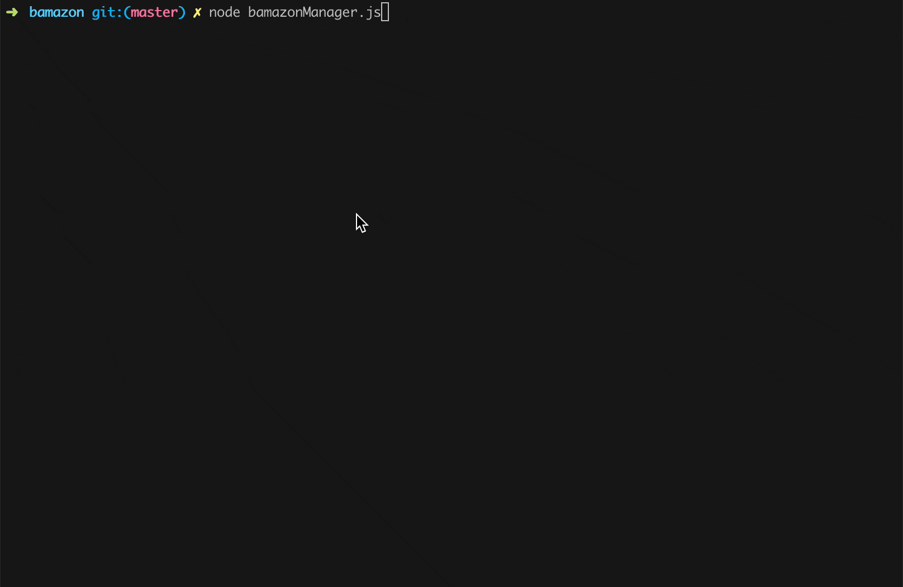

# bamazon

This is an Amazon-like CLI with a customer, manager, and supervisor view.  There are products available for the customer to buy, managers can add items and see & update stock, while supervisors can see how each department is doing sales-wise.

## Customer View
As a customer, you can see the list of products for sale.  Then you can choose one to buy, and, if there is enough stock quantity, your order will be placed.

## Manager View
As a manager, you can view all the products for sale, view low inventory items, add to the inventory, or add a new product.

### See items with low inventory:

### Add to item's inventory:

### Add a new product:

## Supervisor View
As a supervisor, you can view the product sales by department or add a department to the database.

